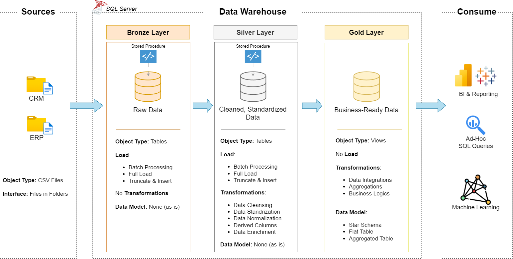

# Data Warehouse Project

Welcome to the **Data Warehouse Project repository**

This project demonstrates a comprehensive data warehousing and analytics solution, from building a data warehouse to generating actionable insights.

----

### Specifications

- **Date Sources**: Import data from two source systems (EXP and CRM) provided as CSV files.
- **Data Quality**: Cleanse and resolve data quality issues prior to analysis
- **Itegration**  : Continue both sources into a single, user-friendly data model designed for analytical queries.
- **Scope**       : Focus on latest dataset only; historization of data is not required.
- **Documentation**: Provide clear documentation of the date model to support both business stakeholders and analytics.

---
## 🏗️ Data Architecture

The data architecture for this project follows Medallion Architecture **Bronze**, **Silver**, and **Gold** layers:

1. **Bronze Layer**: Stores raw data as-is from the source systems. Data is ingested from CSV Files into SQL Server Database.
2. **Silver Layer**: This layer includes data cleansing, standardization, and normalization processes to prepare data for analysis.
3. **Gold Layer**: Houses business-ready data modeled into a star schema required for reporting and analytics.

---

---
## 📖 Project Overview

This project involves:

1. **Data Architecture**: Designing a Modern Data Warehouse Using Medallion Architecture **Bronze**, **Silver**, and **Gold** layers.
2. **ETL Pipelines**: Extracting, transforming, and loading data from source systems into the warehouse.
3. **Data Modeling**: Developing fact and dimension tables optimized for analytical queries.

🎯 This repository is an excellent resource for professionals and students looking to showcase expertise in:
- SQL Development
- Data Architect
- Data Engineering  
- ETL Pipeline Developer  
- Data Modeling  

---

## 🛠️ Important Links & Tools:

Everything is for Free!
- **[Datasets](datasets/):** Access to the project dataset (csv files).
- **[SQL Server Express](https://www.microsoft.com/en-us/sql-server/sql-server-downloads):** Lightweight server for hosting your SQL database.
- **[SQL Server Management Studio (SSMS)](https://learn.microsoft.com/en-us/sql/ssms/download-sql-server-management-studio-ssms?view=sql-server-ver16):** GUI for managing and interacting with databases.
- **[Git Repository](https://github.com/):** Set up a GitHub account and repository to manage, version, and collaborate on your code efficiently.
- **[DrawIO](https://www.drawio.com/):** Design data architecture, models, flows, and diagrams.
- **[Notion](https://www.notion.so/SQL-Data-Warehouse-Project-2bc208d710f7808e972bc06014368b3c):** Get the Project Template from Notion

### License

This Project is Licensed under the [MITLicense](LICENSE). You are free to use, modify and share this project with proper attribution.

### About me

Hi! I’m Charishma Samireddy. I’m creating this data-warehouse project to deepen my skills and move closer to my goal of becoming a Data Engineer.
